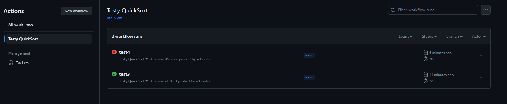
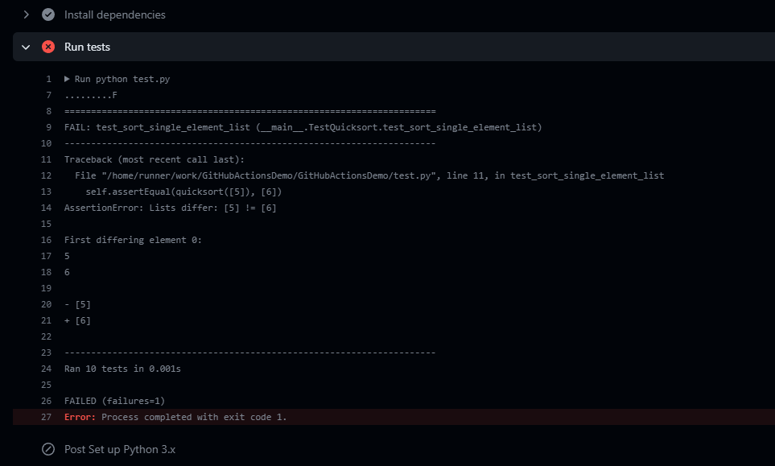

# Lab6 - CI/CD

Do zadania wykorzystałem program z LAB1, w którym uruchamiane są testy poprzez poniższy skrypt dodany do `.github/workflows`

```yaml
name: Testy QuickSort
on:
  push:
    branches: [ main ]
  pull_request:
    branches: [ main ]
jobs:
  build:
    runs-on: ubuntu-latest
    steps:
    - uses: actions/checkout@v2
    - name: Set up Python 3.x
      uses: actions/setup-python@v2
      with:
        python-version: 3.x
    - name: Install dependencies
      run: |
        python -m pip install --upgrade pip
    - name: Run tests
      run: python test.py

```



Powyżej można zobaczyć, że przy pushowaniu były wywołane akcje, które polegały na uruchomieniu testów, w commit'cie `test3` wszystkie przeszły bez problemu lecz po zmianie jednego z testów można już zaobserwoawć niepowodzenie w commit `test4` oraz opisany błąd na poniższym zdjęciu.

